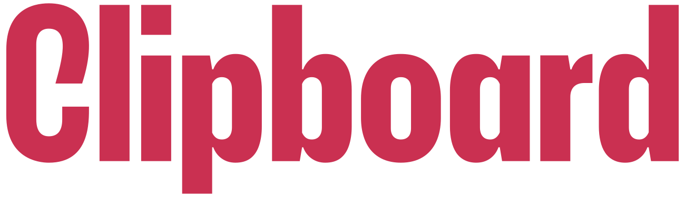
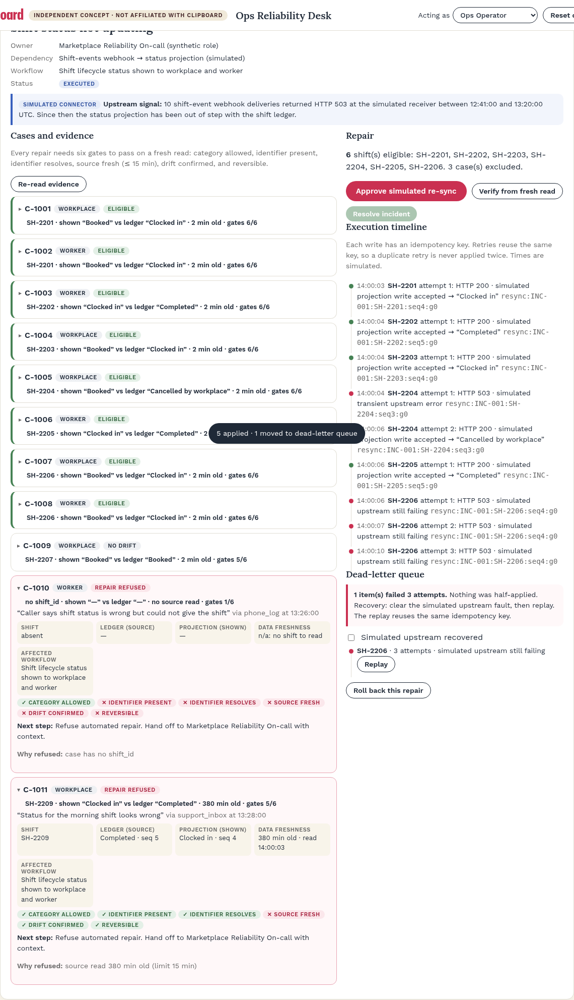

<p> &nbsp;<strong>INDEPENDENT CONCEPT · NOT AFFILIATED WITH CLIPBOARD</strong></p>

# Ops Reliability Desk

**An independent audition concept by Ayo Ahmed** for Clipboard's *Strategy & Ops Lead, Applied AI* role. It is not affiliated with, endorsed by or connected to Clipboard, and it has no access to any Clipboard system. **All data is synthetic. All connectors are simulated. State is browser-only.**

- **Live demo:** not yet published. Run locally with `npm run dev`, or see the [static GitHub Pages fallback](docs/deploy-github-pages.md)
- **Walkthrough video (vertical, 1080×1920):** link to be added. Source script: [docs/video/script.md](docs/video/script.md)
- **Docs (PM + technical package):** [docs/README.md](docs/README.md)
- **Test results (actual output):** [docs/testing/test-results.md](docs/testing/test-results.md)

## What it does

One narrow ops workflow: a simulated upstream **shift-events webhook failure** produces a burst of shift-status support tickets from both workplaces and professionals. The desk turns that burst into **one owned incident**, and repairs it only through a gated, reversible, verified simulated re-sync.

```text
upload CSV → validate (row errors) → deterministic symptom cluster → inspect evidence + 6 risk gates
→ operator approves simulated re-sync → idempotent execution with retry + dead-letter queue
→ fresh-state verification → resolve → export spec + regression case
```

- **Refusal path:** an absent `shift_id` or a stale source read means the repair is refused, and a human handoff is created with context.
- **Sensitive cases:** billing, credential and trust cases always go to a named (synthetic) specialist role. Nothing is auto-decided, and money is never moved.
- **Reliability:** idempotency keys (a duplicate approval, retry or replay never double-applies), 3-attempt backoff, dead-letter queue with replay, duplicate and out-of-order webhook handling, rollback, reset.
- **Classification is deterministic** (a lookup table). AI diagnosis exists only as an [optional adapter specification](docs/21-ai-adapter-spec.md). No model is called.



## Architecture

A static Cloudflare Worker (`src/worker.ts`) serves the app with a strict CSP and exposes `GET /api/health`. It stores nothing. The engine (`src/engine/`) is TypeScript that runs in the browser and saves to `localStorage`. See [ADR-001](docs/14-decision-log-adrs.md).

```text
src/engine/   csv.ts · schema.ts · rules.ts · sample.ts · desk.ts (state machine)
src/ui/       main.ts (renderer + controls)
src/worker.ts static assets + /api/health + security headers
public/       index.html · styles.css · app.js (built) · brand/ · fonts/
test/         Vitest unit + integration
scripts/      e2e.mjs (Playwright) · a11y.mjs (axe-core) · record-walkthrough.mjs
```

## Run locally

```bash
npm ci
npm run check            # typecheck + 31 unit/integration tests + build
npx wrangler dev         # http://localhost:8787
CHROME_PATH=/path/to/chrome node scripts/e2e.mjs   # 16 browser checks (set BASE_URL to target another host)
CHROME_PATH=/path/to/chrome node scripts/a11y.mjs  # axe-core WCAG A/AA
npx wrangler deploy      # Cloudflare Workers free tier
```

## Brand

The brand guide was written before the app code: [docs/brand-design.md](docs/brand-design.md), with a [visual guide](docs/brand/visual-guide.png). The Clipboard name and logo belong to their owner and are used unmodified only to show brand fit. See [NOTICE.md](NOTICE.md).

## Limitations

See [docs/18-limitations.md](docs/18-limitations.md). In short: synthetic data, simulated connectors and clock, single-browser state, no authentication, one playbook, no measured value, and no interviews behind the personas.

Concept and product: Ayo Ahmed. Code under the MIT licence ([LICENSE](LICENSE)). Font licences are in `public/fonts/`.
