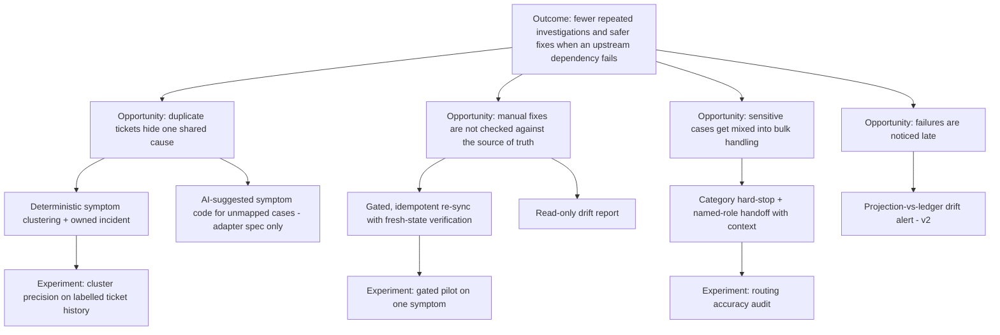

# Opportunity tree and prioritisation

> **Hypothesis.** The scores are assumptions written down to make the reasoning explicit. They are not measurements.

## Opportunity solution tree

## Prioritisation (RICE, assumed inputs)

| Solution | Reach (assumed) | Impact (1–3) | Confidence | Effort (weeks, assumed) | RICE | Decision |
|---|---|---|---|---|---|---|
| A1 Deterministic clustering + owned incident | Medium | 2 | 60% | 2 | high | **Build (v1)** |
| B1 Gated idempotent re-sync + verification | Medium | 3 | 40% | 3 | medium | **Build (v1, simulated)** |
| C1 Sensitive-category hard stop | Every sensitive case | 3 | 80% | 0.5 | high | **Build (v1)** |
| B2 Read-only drift report | Medium | 1 | 60% | 1 | medium | Folded into the evidence view |
| D1 Drift alerting | High | 2 | 40% | 3 | medium | v2 |
| A2 AI symptom suggestion | Low (unmapped only) | 1 | 30% | 2 | low | Spec only |

**Key assumptions:** shift-status bursts happen often enough to matter; a status write has no side effects; a source-of-truth read API exists. If V3 in the [validation plan](05-discovery-validation.md) fails, B1 drops to read-only (B2).
