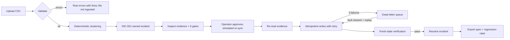
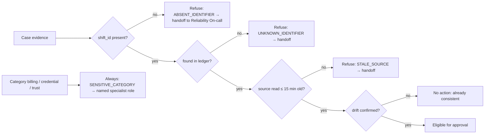
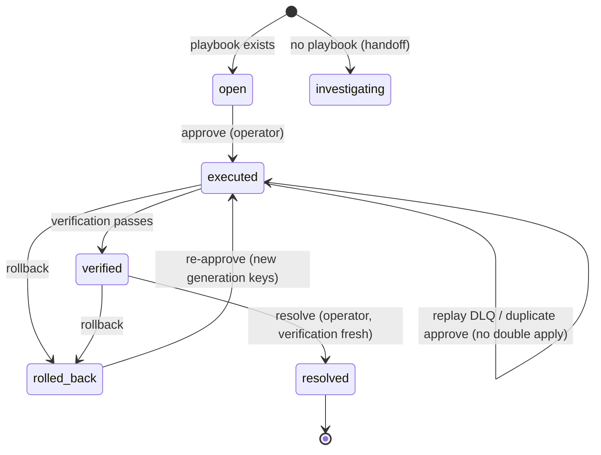
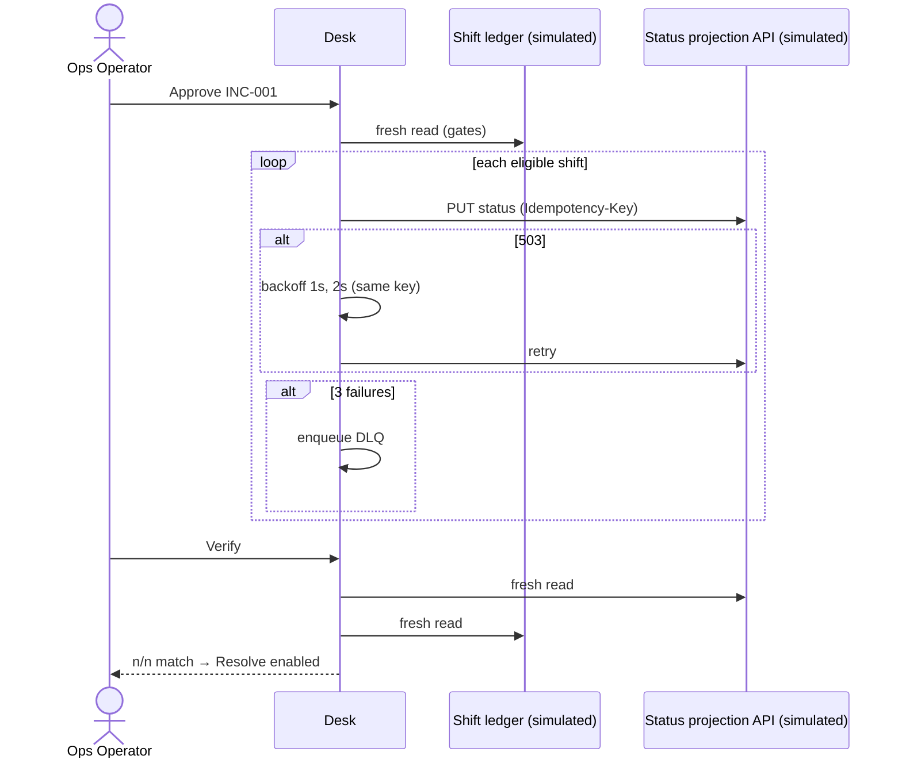

# Workflow diagrams

## Happy path

```mermaid
flowchart LR
  U[Upload CSV] --> V{Validate}
  V -- errors --> X[Row errors with fixes; file not ingested]
  V -- ok --> C[Deterministic clustering]
  C --> I[INC-001 owned incident]
  I --> E[Inspect evidence + 6 gates]
  E --> A[Operator approves simulated re-sync]
  A --> R[Re-read evidence]
  R --> W[Idempotent writes with retry]
  W -- 3 failures --> D[Dead-letter queue]
  D -- fault cleared + replay --> W
  W --> F[Fresh-state verification]
  F -- pass --> S[Resolve incident]
  S --> P[Export spec + regression case]
```

## Refusal path

```mermaid
flowchart LR
  E[Case evidence] --> G1{shift_id present?}
  G1 -- no --> H1[Refuse: ABSENT_IDENTIFIER → handoff to Reliability On-call]
  G1 -- yes --> G2{found in ledger?}
  G2 -- no --> H2[Refuse: UNKNOWN_IDENTIFIER → handoff]
  G2 -- yes --> G3{source read ≤ 15 min old?}
  G3 -- no --> H3[Refuse: STALE_SOURCE → handoff]
  G3 -- yes --> G4{drift confirmed?}
  G4 -- no --> N[No action: already consistent]
  G4 -- yes --> OK[Eligible for approval]
  K[Category billing / credential / trust] --> H4[Always: SENSITIVE_CATEGORY → named specialist role]
```

## Incident state machine

```mermaid
stateDiagram-v2
  [*] --> open: playbook exists
  [*] --> investigating: no playbook (handoff)
  open --> executed: approve (operator)
  executed --> executed: replay DLQ / duplicate approve (no double apply)
  executed --> verified: verification passes
  executed --> rolled_back: rollback
  verified --> resolved: resolve (operator, verification fresh)
  verified --> rolled_back: rollback
  rolled_back --> executed: re-approve (new generation keys)
  resolved --> [*]
```

## Execution sequence

```mermaid
sequenceDiagram
  actor Op as Ops Operator
  participant Desk
  participant Ledger as Shift ledger (simulated)
  participant Proj as Status projection API (simulated)
  Op->>Desk: Approve INC-001
  Desk->>Ledger: fresh read (gates)
  loop each eligible shift
    Desk->>Proj: PUT status (Idempotency-Key)
    alt 503
      Desk->>Desk: backoff 1s, 2s (same key)
      Desk->>Proj: retry
    end
    alt 3 failures
      Desk->>Desk: enqueue DLQ
    end
  end
  Op->>Desk: Verify
  Desk->>Proj: fresh read
  Desk->>Ledger: fresh read
  Desk-->>Op: n/n match → Resolve enabled
```
