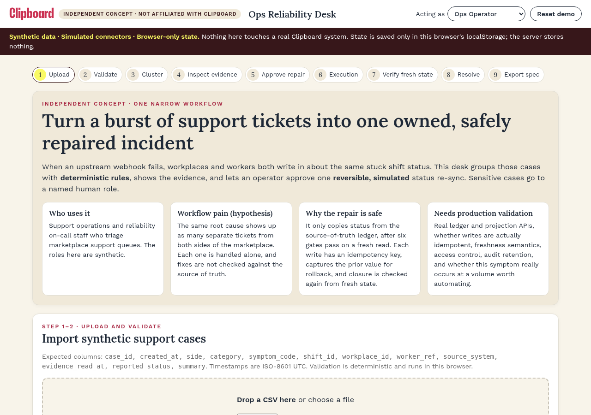
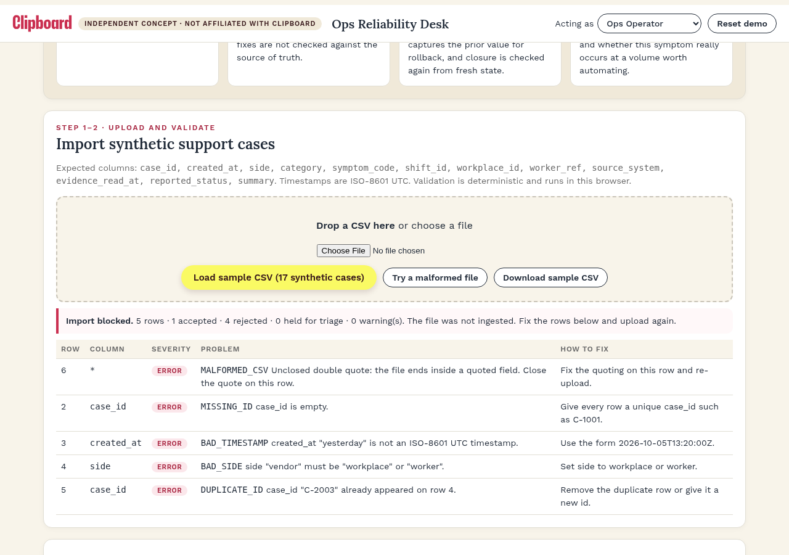
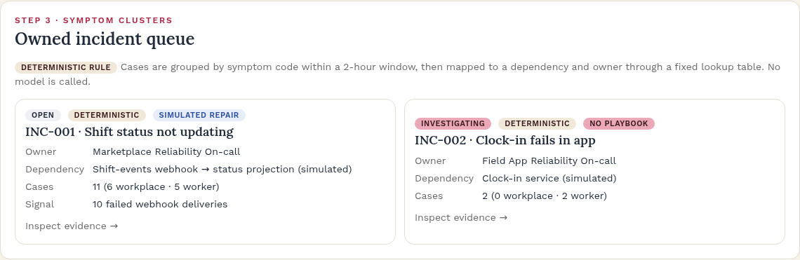
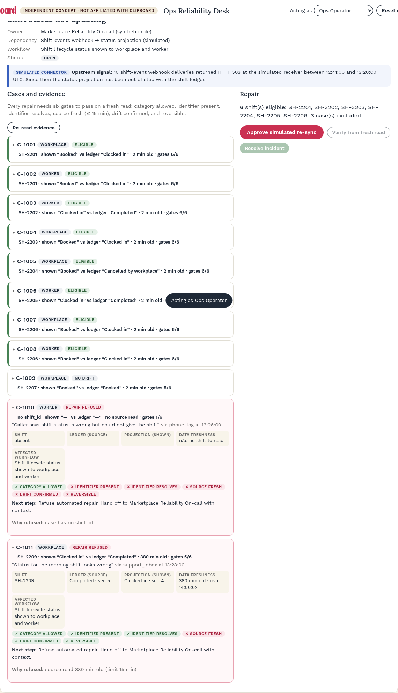
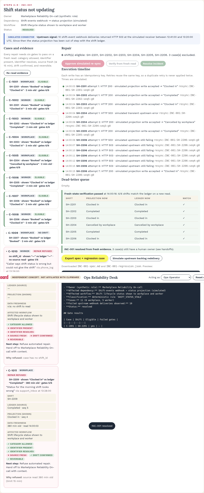
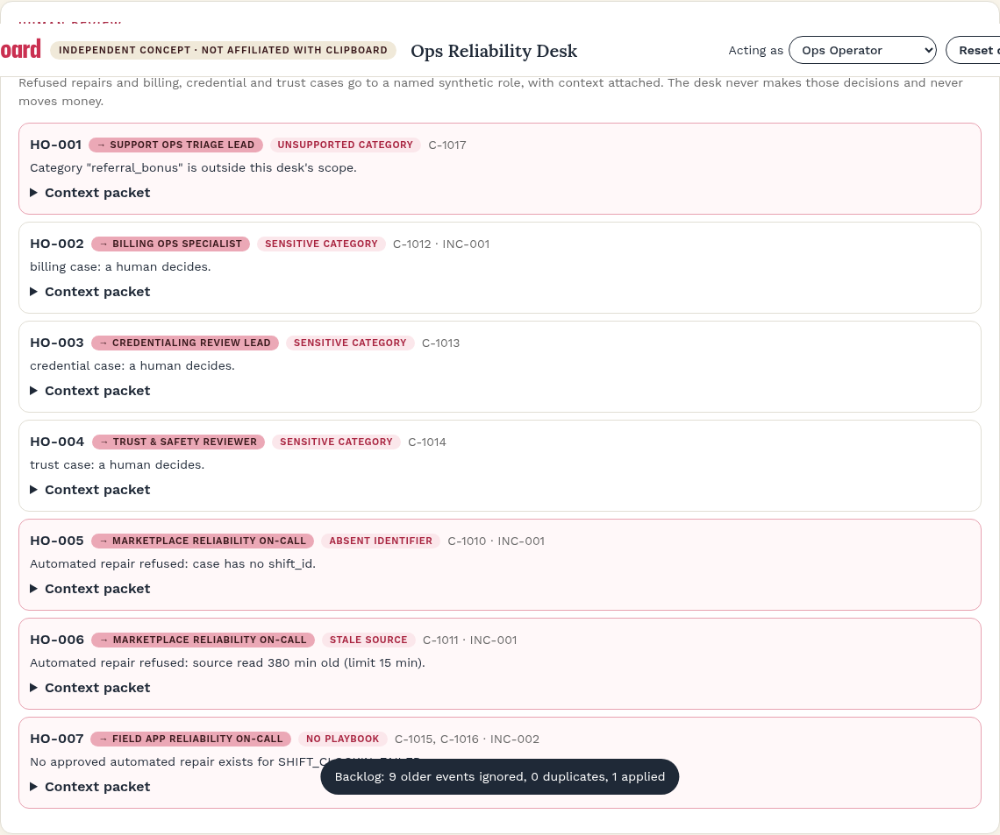
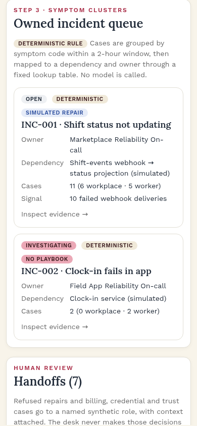

# Clickable flow and wireframes

The **clickable flow is the live demo itself** (link in the [root README](../README.md)). The screens below are actual screenshots taken by `scripts/e2e.mjs` during the automated run, in flow order.

| Step | Screen | Screenshot |
|---|---|---|
| 1 | Landing: who it's for, workflow pain (hypothesis), why the repair is safe, what needs production validation |  |
| 2 | Malformed file: row-level errors with fixes; import blocked |  |
| 3 | Sample accepted: owned incident queue with deterministic rule badges |  |
| 4 | Incident detail: upstream signal, per-case evidence and gates, refusals |  |
| 5 | After approval: execution timeline with retries and the dead-letter queue |  |
| 6 | Verified, resolved and exported |  |
| 7 | Human handoffs to named synthetic roles |  |
| 8 | Mobile (390 px) |  |

## Layout wireframe

```text
┌ Logo · INDEPENDENT CONCEPT · NOT AFFILIATED ─ Ops Reliability Desk ─ [Acting as ▾] [Reset] ┐
├ Banner: Synthetic data · Simulated connectors · Browser-only state ───────────────────────┤
│ Stepper 1 Upload › 2 Validate › 3 Cluster › … › 9 Export                                   │
│ Intro: Who uses it | Workflow pain (hypothesis) | Why safe | Needs production validation  │
│ Import: [drop zone] [Load sample] [Try malformed] [Download sample]  → validation table   │
│ Queue: incident cards (status · Deterministic · owner · dependency · cases)               │
│ Detail: header · upstream signal ┬ Cases & evidence (expandable, gates) │ Repair panel    │
│                                  │                                     │ timeline · DLQ  │
│                                  │                                     │ verify · export │
│ Handoffs · Synthetic metrics · Audit log · How this demo works                            │
└ Footer: Concept by Ayo Ahmed · not affiliated · source ───────────────────────────────────┘
```
